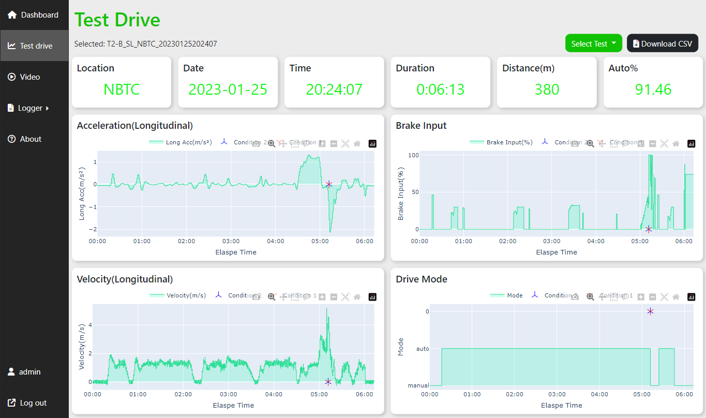

# Autonomous Vehicle Incident Dashboard

part of senior project

A web application built for interactive dashboard visualizing data from autonomous vehicle testing. Users can view the summarized and individual test data and search for incident video with the provided filter. Also, users can create test log by filling in forms and edit or delete the data.

### Demo App

- [https://incident-dashboard-clhw.onrender.com/](https://incident-dashboard-clhw.onrender.com/)

### Tools

- HTML5, CSS3, Bootstrap
- Database: MongoDB Atlas (Pymongo & Djongo)
- Framework: Django
- Visualizations: Ploty
